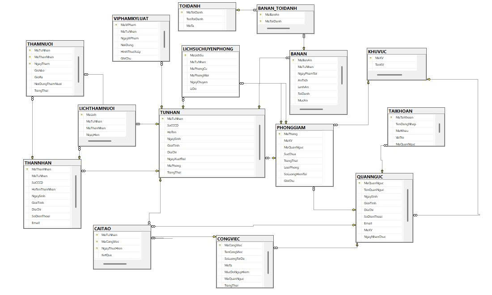

# Hệ thống quản lí nhà tù (Prison Management System)
## 📖 Giới thiệu 
**Đây là bài tập lớn môn hệ quản trị cơ sở dữ liệu với mục tiêu xây dựng hệ thống quản lí nhà tù của sinh viên Khoa Công nghệ thông tin - Trường Đại học Nha Trang (NTU)**

**Giảng viên hướng dẫn**: Phạm Thị Thu Thuý

## 🤝 Thành viên nhóm
1. Nguyễn Ngọc Xuân Ánh - 66130165
2. Huỳnh Tấn Vũ - 66134543
3. Võ Trần Gia Hưng - 66131266
4. Bùi Huỳnh Anh Kiệt - 66131655

## 🗂️ Tổng quan về hệ thống
Hệ thống quản lý nhà tù được xây dựng nhằm hỗ trợ việc lưu trữ và quản lý thông tin trong trại giam một cách hiệu quả và chính xác.

Hệ thống cho phép quản lý các đối tượng chính như phạm nhân, quản giáo, phòng giam, khu giam giữ, cùng các hoạt động liên quan như thăm nuôi, kỷ luật và khen thưởng.

Dữ liệu được tổ chức trong cơ sở dữ liệu quan hệ, giúp dễ dàng truy vấn, thống kê và đảm bảo tính nhất quán.

## 🗄️ Sơ đồ cơ sở dữ liệu
Dưới đây là cấu trúc liên kết giữa 15 bảng dữ liệu đã chuẩn hoá 3NF của hệ thống:

## 🖥️ Giao diện ứng dụng

## 🛠️ Hướng dẫn cài đặt và chạy thử
Chi tiết các bước hướng dẫn cài đặt chương trình Quản lí nhà tù đã được nhóm biên soạn đầy đủ trong file hướng dẫn riêng.
[Vui lòng xem chi tiết tại đây](docs/)

## ⚙ Công nghệ sử dụng
- **SQL Server**: Hệ quản trị cơ sở dữ liệu dùng để lưu trữ và quản lý dữ liệu
- **T-SQL**: Ngôn ngữ truy vấn và thao tác dữ liệu trong SQL Server
- **Visual Studio**: Môi trường phát triển ứng dụng winform
- **ADO.NET**: Kết nối và thao tác với cơ sở dữ liệu SQL Server

